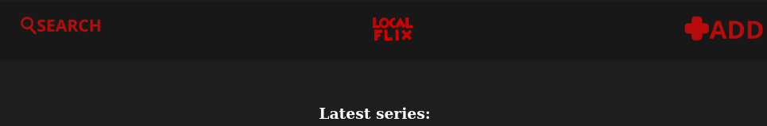

# Localflix



A lightweight self-hosted media library for movies and series. Store, view, and manage your personal video collection with a clean browser interface.

## Features

### Content Management
- **Movies** — Upload video files with automatic thumbnail generation and metadata storage
- **Series** — Organize episodes by season with per-episode thumbnails
- **Search** — Find content by title, author, tags, or description keywords
- **Delete** — Remove movies or entire series (with all episodes) from the UI

### Upload & Processing
- **Quality selection** — Choose output quality: Original, 1080p, 720p, or 480p
- **Audio track selection** — Pick which audio streams to keep (multi-language support)
- **Subtitle track selection** — Choose which embedded subtitle tracks to preserve (bitmap subs auto-filtered)
- **External subtitles** — Upload `.srt` files to embed as selectable subtitle tracks
- **FFprobe analysis** — Video tracks are analyzed on upload for track selection
- **Automatic thumbnails** — Generated from the 20-second mark of each video
- **Series autocomplete** — Type-to-search when adding episodes to existing series

### Video Player
- **Seekable streaming** — HTTP range requests for smooth seeking and skipping
- **Custom controls** — Play/pause, skip ±10s, mute, fullscreen, clickable progress bar with hover preview
- **Audio track selector** — Switch between audio tracks in the player
- **Subtitle selector** — Choose subtitle track or turn off
- **Download button** — Direct download link for the video file
- **Keyboard shortcuts** — Space (play/pause), ←/→ (skip ±10s), F (fullscreen), M (mute)

### UI/UX
- **Dark/Light mode** — Manual toggle with sun/moon icon, saved to localStorage, respects system preference
- **Text-based navigation** — Clean header with Localflix brand, Search, and Add Content links
- **Card-based add page** — Visual cards for Movie, Series, and Episode uploads
- **Modern SaaS dashboard** design with subtle animations and frosted glass header
- **Responsive grid layouts** — Adapts from 5 columns to 2 columns
- **Accessible** — Focus rings, semantic HTML, proper contrast

## Tech Stack

| Layer | Technology |
|-------|-----------|
| Backend | Node.js + Express 5 |
| Database | MySQL 8.3 |
| Video Processing | FFmpeg (fluent-ffmpeg) |
| Frontend | Vanilla HTML/CSS/JS (zero framework) |
| Containerization | Docker + Docker Compose |

## Quick Start (Docker)

The easiest way to run Localflix is with Docker Compose:

```bash
# Clone the repository
git clone https://github.com/svdecoder/Localflix.git
cd Localflix

# Configure environment — this .env goes in the project root, next to
# docker-compose.yml. It's a different file from data/mysql/.env (see the
# "Environment Variables" section below for why there are two).
cp .env.example .env
# Edit .env and set a secure MYSQL_ROOT_PASSWORD

# Start the stack
docker compose up -d

# Open http://localhost:3000
```

The database schema is automatically initialized on first run. Media files persist to the `data/` directory on your host via bind mounts.

## Manual Setup

### Prerequisites
- **Node.js** 18+
- **FFmpeg** (must be available in PATH)
- **MySQL** 8.0+ (or Docker for MySQL only)

### Installation

```bash
# Install dependencies
npm install

# Configure database
cd data/mysql
cp .env.example .env
# Edit .env — set MYSQL_PASSWORD, MYSQL_ROOT_PASSWORD, DATABASE, HOST
nano .env

# Start MySQL (if using Docker for DB only)
docker compose up -d
docker exec -it mysql_database mysql -u root -p -e "CREATE DATABASE IF NOT EXISTS localflix;"
docker exec -i mysql_database mysql -u root -p localflix < schema.sql

# Start the application
cd ../..
node server.js
```

Open **http://localhost:3000** in your browser.

## Environment Variables

Localflix uses **two separate `.env` files**, depending on how you're running it — using the wrong one for your setup is a common source of "can't connect to database" errors:

| File | Used by | When |
|------|---------|------|
| `.env` (project root, from `.env.example`) | The root `docker-compose.yml` — both the `db` service (password substitution) and the `app` container (`env_file`) | **Quick Start (Docker)** — running the full stack with `docker compose up -d` |
| `data/mysql/.env` (from `data/mysql/.env.example`) | `data/mysql/docker-compose.yaml` (MySQL-only container) and `node server.js` directly | **Manual Setup** — running MySQL in Docker but the app with plain Node |

### Root `.env` (Docker Quick Start)

| Variable | Description | Default |
|----------|-------------|---------|
| `MYSQL_ROOT_PASSWORD` | MySQL root password — the app always connects as `root` | *(required)* |
| `MYSQL_DATABASE` | Database name | `localflix` |
| `HOST` | MySQL host as seen from inside the `app` container | `db` (must stay `db` — this is the Compose service name, not `localhost`) |

### `data/mysql/.env` (Manual Setup)

| Variable | Description | Default |
|----------|-------------|---------|
| `MYSQL_PASSWORD` | MySQL user password | *(required)* |
| `MYSQL_ROOT_PASSWORD` | MySQL root password | *(required)* |
| `DATABASE` | Database name | `localflix` |
| `HOST` | MySQL host | `localhost` |

## Project Structure

```
Localflix/
├── server.js              # Express server entry point
├── package.json
├── Dockerfile             # Application container
├── docker-compose.yml     # Full stack orchestration
├── scripts/               # Backend business logic
│   ├── addMovie.js        # Movie upload & processing
│   ├── addEpisode.js      # Episode upload & processing
│   ├── addSerie.js        # Series creation
│   ├── getDataMovie.js    # Movie data queries
│   ├── getDataSerie.js    # Series data queries
│   ├── getDataEpisodes.js # Episodes list queries
│   ├── getDataEpisode.js  # Single episode query
│   ├── index.js           # Homepage video list
│   ├── search.js          # Search functionality
│   └── videoProbe.js      # FFprobe track detection
├── public/                # Frontend
│   ├── css/styles.css     # Stylesheet (dark/light mode with CSS variables)
│   ├── js/                # Client-side JavaScript
│   └── html/              # HTML pages
├── data/                  # Persistent data (bind mounted)
│   ├── movies/            # Processed movie files
│   ├── serie/             # Episode files (by series)
│   ├── thumbnail/         # Auto-generated thumbnails
│   ├── uploads/           # Temporary upload staging
│   ├── images/            # UI images (logo, icons)
│   └── mysql/             # Database configuration
│       ├── .env           # Database credentials
│       ├── schema.sql     # Database schema
│       └── docker-compose.yaml  # MySQL container
└── .dockerignore
```

## API Endpoints

| Method | Path | Description |
|--------|------|-------------|
| GET | `/api/newVideo` | Latest movies and series |
| GET | `/api/dataMovie?id=` | Movie metadata |
| GET | `/api/dataSerie?title=` | Series metadata |
| GET | `/api/dataEpisodes?title=&season=` | Episodes by season |
| GET | `/api/dataEpisode?id=` | Single episode metadata |
| GET | `/api/search?request=&specification=` | Search content |
| GET | `/api/videoTracks?path=` | Probe video audio/subtitle tracks |
| GET | `/api/searchSeries?q=` | Search series by partial title |
| GET | `/stream/movie/:id` | Stream movie (range requests) |
| GET | `/stream/serie/:serie/:id` | Stream episode (range requests) |
| POST | `/api/probeUpload` | Upload & probe video for track selection |
| POST | `/api/uploadSrt` | Upload external `.srt` subtitle file |
| POST | `/add-movie` | Upload & process movie (multipart) |
| POST | `/add-serie` | Create series with thumbnail (multipart) |
| POST | `/add-episode` | Upload & process episode (multipart) |
| DELETE | `/api/movie/:id` | Delete movie (file + DB) |
| DELETE | `/api/serie/:title` | Delete series and all episodes (files + DB) |

## Keyboard Shortcuts (Video Player)

| Key | Action |
|-----|--------|
| `Space` | Play / Pause |
| `←` | Skip back 10 seconds |
| `→` | Skip forward 10 seconds |
| `F` | Toggle fullscreen |
| `M` | Mute / Unmute |

## Security

This application is designed for **trusted local/private networks** and intentionally has no authentication.

Security measures implemented:
- All SQL queries use parameterized statements (no SQL injection)
- Column name whitelisting in search queries
- Path traversal protection on all file operations
- Input sanitization on all user-provided data
- HTML escaping to prevent XSS
- No stack traces leaked to the UI
- No secrets exposed to the client

## License

MIT License — see [LICENSE](LICENSE) for details.